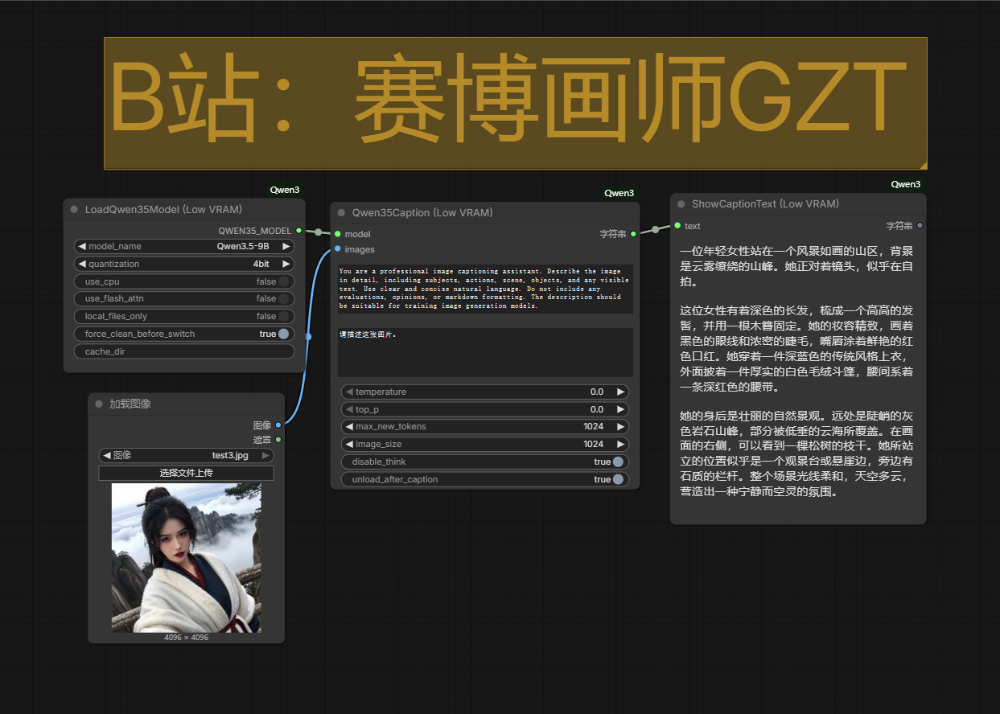
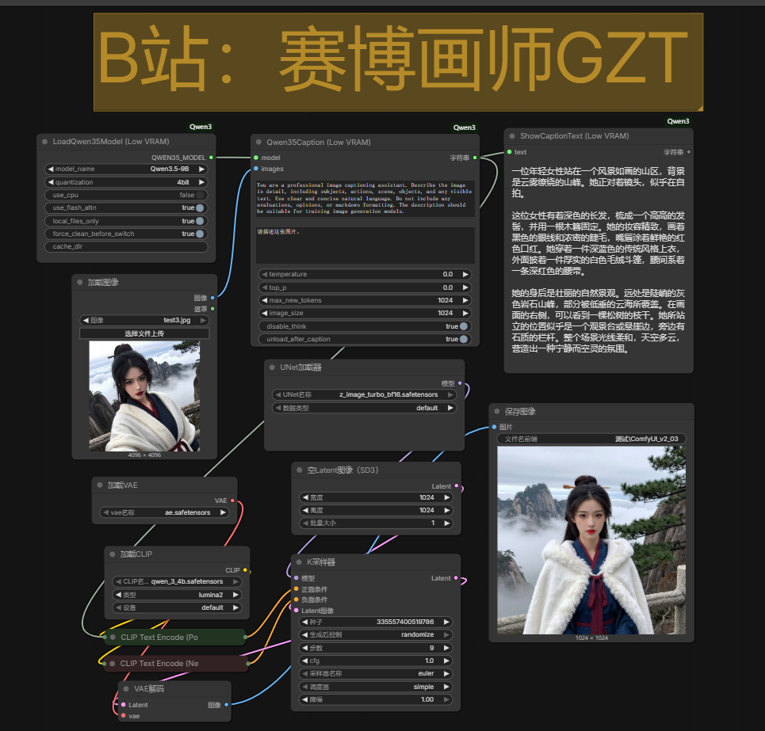

# ComfyUI-Qwen3.5-Low-VRAM-GPU

充电支持：🔗 [B站：赛博画师GZT](https://space.bilibili.com/702745384)

针对12G低显存GPU、32G低内存深度优化, 专为ComfyUI设计的Qwen3.5图像描述插件。 

第一次运行，自动从国内ModelScope下载模型，完全阻断HuggingFace连接。下载模型之后，即可拔掉网线运行，可完全离线，网络环境友好。

支持量化加载与智能显存管理。支持 Qwen3.5-2B/4B/9B/27B/35B-A3B 等模型。

本插件使用纯AI生成，已成功运行。
以下内容也使用AI生成。

This plugin is entirely AI-generated and has been successfully run. 
The following content is also generated using AI.

##  ✨ 核心特性

 🚀 纯国内加速：默认从ModelScope下载模型，彻底规避HuggingFace连接问题，支持完全离线运行。

💾 极致显存管理：

自动切换卸载：切换模型时，自动卸载旧模型，杜绝资源残留。

推理后可选卸载：生成描述后（默认开启），立即从显存/内存中卸载模型，为后续工作流（如生图）腾出全部空间。

📊 低显存量化：支持 4bit 和 8bit 量化，加载2B/4B模型仅需2-4GB显存。

🖥️ 优雅的文本显示：自带前端节点，直接显示生成的描述，支持框选复制，并完美适配深色/浅色主题。

🔌 即插即用：完全集成ComfyUI节点系统，无需复杂配置。

##  📦 安装

方法一：直接下载（推荐）

进入ComfyUI的 custom_nodes 目录。

克隆本仓库：

cd custom_nodes

git clone https://github.com/GZT2023/ComfyUI-Qwen3.5-Low-VRAM-GPU.git

安装依赖：

pip install modelscope bitsandbytes opencv-python accelerate transformers

注意：bitsandbytes 在Windows上可能需要预编译版本，如遇安装问题，可暂时不使用量化（选择 none）。

方法二：手动安装

下载本仓库的ZIP压缩包，解压至 custom_nodes/ComfyUI-Qwen3.5-Low-VRAM-GPU/。

在插件目录下，使用ComfyUI的Python环境运行：

pip install -r requirements.txt

（请确保您已创建包含上述依赖的 requirements.txt 文件）

便携包环境的话，在便携包目录ComfyUI_windows_portable下运行：

.\python_embeded\python.exe -m pip install -r .\ComfyUI\custom_nodes\ComfyUI-Qwen3.5-Low-VRAM-GPU\requirements.txt

## 🚀 快速开始

重启ComfyUI，在节点菜单中找到分类 ComfyUI-Qwen3.5-Low-VRAM-GPU。

添加以下三个节点，并按下图连接：

LoadQwen35Model (Low VRAM)：选择模型（如 Qwen3.5-2B）和量化等级。

Qwen35Caption (Low VRAM)：连接模型和待处理的图像。

ShowCaptionText (Low VRAM)：连接生成的文本，并直接显示结果。

执行工作流。首次使用且未勾选 local_files_only 时，插件会自动从ModelScope下载模型至 ComfyUI/models/Qwen/ 目录。

第一次运行下载模型后，勾选local_files_only，即可拔掉网线运行，完全离线。

生成的描述将实时显示在 ShowCaptionText 节点上，并可框选复制。

## 🧩 节点详解

1. LoadQwen35Model (Low VRAM)

功能：加载Qwen3.5模型，自动管理本地缓存。

参数：

model_name: 选择模型尺寸（2B/4B/9B等）。

quantization: 量化等级 (none / 4bit / 8bit)，4bit可极大降低显存占用。

use_cpu: 强制使用CPU加载（极慢，不推荐）。

use_flash_attn: 启用Flash Attention 2（需PyTorch≥2.0）。

local_files_only: True 时仅从本地加载，False 时优先本地，无缓存则从ModelScope下载。

cache_dir: 自定义模型缓存路径（默认：ComfyUI/models/Qwen/）。

2. Qwen35Caption (Low VRAM)

功能：执行图像描述推理。

参数：

model: 来自上一节点的模型对象。

images: 待描述的图像（ComfyUI的IMAGE类型）。

system_prompt / user_prompt: 自定义提示词。

temperature / top_p: 生成参数（0表示使用模型默认）。

max_new_tokens: 最大生成长度。

image_size: 图像预处理尺寸。

disable_think: 默认开启，移除模型内部思考标签（如 <think>...</think>）。

unload_after_caption: 默认开启，生成后立即卸载模型，释放显存。

3. ShowCaptionText (Low VRAM)

功能：在节点上直接显示生成的描述文本。

特点：文本直接呈现在节点界面，支持鼠标框选复制，并自动适应深色/浅色主题。

输入：text - 需要显示的字符串。

⚙️ 依赖要求

ComfyUI 主程序（基础依赖如 torch, transformers 等）。

额外必须安装：

modelscope

bitsandbytes

opencv-python

accelerate

## ❓ 常见问题

Q: 为什么看不到 ShowCaptionText 节点上的文本？

A: 请确保您使用的是插件自带的前端文件 (js/showCaption.js)。如果文本不显示，尝试重启ComfyUI或检查控制台是否有JS错误。该节点已深度适配深色主题。

Q: 切换模型时显存没有立即释放怎么办？

A: 插件已内置自动切换卸载机制。如果发现异常，可以尝试手动点击 LoadQwen35Model 节点加载新模型，旧模型会被自动清理。您也可以在工作流末尾开启 unload_after_caption。

Q: 我想完全离线使用，该如何操作？

A: 1. 首次使用时，设置 local_files_only=False，让插件联网从ModelScope下载模型。2. 下载完成后，将 local_files_only 设为 True，此后插件将完全离线运行，不再有任何网络请求。

Q: 如何卸载插件？

A: 直接从 custom_nodes 目录中删除 ComfyUI-Qwen3.5-Low-VRAM-GPU 文件夹即可。已下载的模型缓存（默认在 models/Qwen/）需手动删除。

📝 更新日志

2026-03-11: 发布首个正式版本，实现核心功能、低显存管理及ModelScope优先下载。

